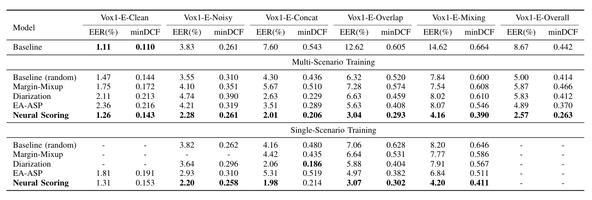

# NS-SV: Neural Scoring for speaker verification

This is an open-source project that develops a novel framework for speaker verification. The code is developed based on [sunine](https://gitlab.com/csltstu/sunine/-/tree/develop/).
In this project, our goal is to design a "general solver", which could operate effectively across a wide range of real-world scenarios (eg. clean, noisy, multi-speaker).


## Overview


## Quick installation
1. Clone this repo

```base
git clone https://github.com/DozingOFFF/NS-SV.git
```

2. Create conda env and install the requirements

```base
conda create -n ns python=3.8
conda activate ns
conda install pytorch==2.2.1 torchaudio==2.2.1 pytorch-cuda=11.8 -c pytorch -c nvidia
pip install -r requirements.txt
```


## Methodologies

Note that the configuration files should be modified before running the commands.

### Data simulation

We provide test datasets for four conditions(Noisy, Concatenation, Overlap, Mixing), which is simulated from [VoxCeleb1](https://www.robots.ox.ac.uk/~vgg/data/voxceleb/vox1.html) and can be found on [Huggingface.co](https://huggingface.co/datasets/Dozingofff/NS-Vox-Complex/tree/main) .

To generate datasets and trial lists, run the following command:

```base
python steps/create_evaldata.py
```

### Model Training

#### Step1: Prepare enrollment model

The enrollment model can be pre-trained using [sunine](https://gitlab.com/csltstu/sunine/-/tree/develop/).

#### Step2: Train NS model for clean-scenario

```base
python main.py --config conf/ns_clean.yaml
```

#### Step3: Train NS model for multi-scenario

```base
python main.py --config conf/ns_multi.yaml
```

#### Step5: average model checkpoints

```base
python steps/avg_model.py
```

### Model Evaluation

```base
bash eval.sh
```

### Model Performance

Model performance on VoxCeleb1 and four corrupted test set is shown in the tables below.

#### Vox1-O


#### Vox1-E


#### Vox1-H
